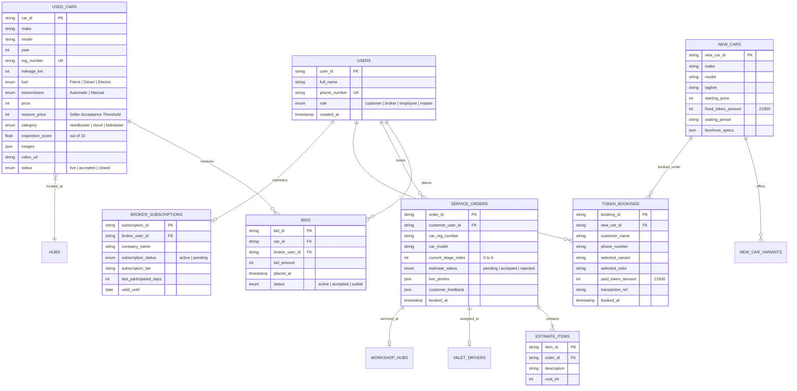
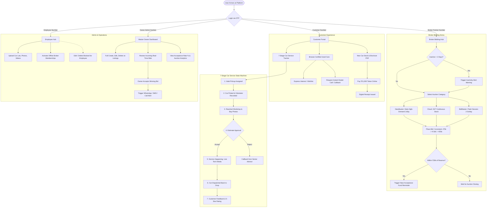

# AutoVault: Automotive Marketplace, Live Dealer Bidding & 7-Stage Service Platform

> Next-generation digital automotive web application built directly from the client's 7-page specification notes, featuring multi-role authentication, high-frequency broker auctions, live 7-stage vehicle service tracking, and new car ₹21,000 online token booking.

🚀 **Live Production Deployment:** [https://car-theta-teal.vercel.app](https://car-theta-teal.vercel.app)  
📦 **GitHub Repository:** [https://github.com/drdhavaltrivedi/autovault-platform](https://github.com/drdhavaltrivedi/autovault-platform)

---

## Table of Contents
1. [Project Overview](#project-overview)
2. [What the Client Planned (PDF Notes Breakdown)](#what-the-client-planned-pdf-notes-breakdown)
3. [What We Built (Features & Architecture)](#what-we-built-features--architecture)
4. [Entity Relationship (ER) Diagram](#entity-relationship-er-diagram)
5. [System User Flows & Architecture Diagrams](#system-user-flows--architecture-diagrams)
6. [Role-Based Access Control (RBAC) Matrix](#role-based-access-control-rbac-matrix)
7. [Discussion Points & Q&A for the Client](#discussion-points--qa-for-the-client)
8. [Local Development & Vercel Deployment](#local-development--vercel-deployment)

---

## Project Overview

AutoVault is a mobile-first, responsive full-stack automotive platform. It provides consumer marketplace browsing, private dealer auction lots with smart rule triggers, an interactive 7-stage doorstep service tracking pipeline, and new car discovery with digital token bookings.

---

## What the Client Planned (PDF Notes Breakdown)

The client's 7-page handwritten notebook defined a **progressive 3-tier delivery roadmap**:

### 1. Delivery Tier Comparison Matrix (Page 1 in Notes)

| Module / Feature | Option A (Auction MVP) | Option B (+ Live Service) | Option C (Full Suite) |
| :--- | :---: | :---: | :---: |
| **Old Car Auction / Bidding Engine** | **Dynamic** | **Dynamic** | **Dynamic** |
| **Old Car Customer Catalog** | **Dynamic** | **Dynamic** | **Dynamic** |
| **Car Service 7-Stage Tracker** | *Static* | **Dynamic** | **Dynamic** |
| **New Car Discovery & Token Booking** | *Static* | *Static* | **Dynamic (₹21k Token + Receipt)** |
| **Insurance Section** | *Static* | *Static* | *Static* |
| **Home Page (Company, Hubs, Journey)** | *Static* | *Static* | *Static* |

### 2. Detailed Specifications from Client Notes

* **Option A: Old Car Marketplace & Auction Arena (Pages 3, 5, 7):**
  * **OTP Login:** Login is strictly by OTP (`login only by OTP`).
  * **Automatic Broker Redirection:** When a registered broker/channel partner mobile number logs in, the **BidMaster section opens directly inside the old car section**.
  * **Customer Features:** Browse vehicle stock, express interest via **Heart button** (shortlist), or call the dealership directly via the **Call Us** hotline.
  * **3 Bidding Categories:**
    1. **Needbuster:** High-demand hot inventory lots (conducted **once a day**).
    2. **Cloud:** Full used car inventory stock available for **24/7 continuous anytime bidding**.
    3. **BidMaster:** General live flash auctions running **2 to 3 times every day**.
  * **Automated Trigger Rules:**
    * **Inactivity Reminder:** Auto-generated alerts for channel partners who have not participated in BidMaster for **> 2 days**.
    * **Near-Acceptance Alert:** If a broker's bid is close to the seller's reserve/acceptance threshold, an alert is triggered advising them to **add funds or increase the bid**.
    * **Auction Acceptance Alerts:** Winning acceptance notified via **Call / SMS / WhatsApp**.
    * **Offline Subscription:** Broker app memberships are verified and managed **offline**.
  * **Panels & Permissions:**
    * **Master / Owner (Business Side):** Can Edit, Delete, review live bid results, accept bids, and view **Auction Acceptance Statistics & General Analytics**.
    * **Employee (Business Side):** Can upload car details, photos, and inspection videos; manage offline subscriptions; strictly **No Edit / No Delete** permissions.
    * **Customer Side:** Informative browsing, heart wishlist, direct call.
    * **Broker Side:** View inventory lots and place bids.

* **Option B: 7-Stage Car Service Tracking Pipeline (Pages 2, 4):**
  * Initiated by entering **Car Registration Number** and **Car Model**.
  * **7 Sequential Tracking Stages:**
    1. **Pickup Car:** Valet driver allotment with driver name, contact, and driver photo.
    2. **Car Picked:** Pickup confirmation with digital odometer reading and condition intake.
    3. **Workshop Arrival:** Workshop check-in photos displayed in-app.
    4. **Estimate Acceptance:** Detailed service cost breakdown with interactive **Accept / Reject (Yes/No)** digital consent.
    5. **Service Happening:** Live backend photographic & video proof of car getting serviced by mechanics.
    6. **Car Moves Back to Drop:** Live return transit dispatch with valet delivery ETA.
    7. **Customer Feedback:** Post-service survey (punctuality, cleanliness, star rating).

* **Option C: New Car Discovery & Online Token Booking (Page 6):**
  * Browse available new car stock with specs and variants.
  * **Download Brochure PDF** for individual models.
  * **Book Car Online for ₹21,000 Token:** Fixed ₹21k priority booking token. *Explicit note: Only booking amount handled online — no complex down payments or loan processing.*
  * **Automated Digital Receipt Generation:** Instant downloadable/printable tax invoice with reference ID.

---

## What We Built (Features & Architecture)

We engineered the **complete Option C architecture** equipped with a real-time **Proposal Scope Switcher** so the client can demonstrate all three tiers seamlessly:

1. **Interactive Scope Switcher Bar:**
   * Toggle between `Option A (Auction MVP)`, `Option B (+ Service Pipeline)`, and `Option C (Full Suite)`.
   * Switching dynamically toggles feature gates and displays informative previews for static tiers.

2. **OTP Login System with 1-Click Demo Profiles:**
   * Clean 4-digit OTP verification.
   * Includes one-click persona presets for instant demonstrations:
     * 👤 **Customer:** `9871100223` (Ananya Verma)
     * 🤝 **Broker:** `9876543210` (Rajesh Malhotra, Malhotra Auto Empire)
     * 📋 **Employee:** `9833001100` (Vikrant Deshmukh, Inspector)
     * 👑 **Master Owner:** `9999999999` (Kabir Singhal, Super Admin)

3. **Broker Bidding Arena:**
   * Live countdown timers for Needbuster daily batches.
   * Continuous 24/7 Cloud stock bidding.
   * Scheduled BidMaster flash sessions with quick bid buttons (`+₹5,000`, `+₹10,000`, `+₹25,000`) and custom bids.
   * Automated inactivity alert for partners inactive > 2 days.
   * Real-time "Near Seller Acceptance" fund reminder banner.
   * Simulated WhatsApp and SMS notification center.

4. **Live 7-Stage Car Service Module:**
   * Registration lookup (`DL-04-ER-9821`) and Car Model search.
   * Complete 7-step visual stepper with live stage progression.
   * Valet driver profile card with allotment photo and contact.
   * Real check-in bay photos with defensive `onError` image fallbacks.
   * Itemized estimate approval table with **Yes, Accept** and **No, Reject** actions.
   * Live photographic proof stream from workshop mechanics.
   * Interactive 5-star customer feedback survey.
   * "Book New Service" modal to dispatch a new service order on the fly.

5. **New Car Booking & Receipt Generator:**
   * New car flagship showcase (XUV700, Verna Turbo, Harrier Dark Edition, Hyryder Hybrid).
   * Official Brochure PDF modal with printable layout.
   * Online checkout gateway for ₹21,000 priority booking fee (UPI, Card, NetBanking).
   * Digital Receipt generator producing an official tax invoice with unique reference ID.

6. **Administrative Hubs & Security:**
   * **Employee Portal:** Vehicle upload form (specs, photos, inspection videos) and offline broker subscription activator. Enforces **No Edit / No Delete** rule.
   * **Master Owner Dashboard:** Full inventory CRUD, real-time bid acceptance with confetti celebration, and **Auction Acceptance Analytics** (Acceptance Rate %, Total Bids, Gross Realization in Crores).

---

## Entity Relationship (ER) Diagram



---

## System User Flows & Architecture Diagrams

### 1. End-to-End Customer & Broker Journey Flowchart



---

## Role-Based Access Control (RBAC) Matrix

| Feature / Capability | Customer | Broker / Partner | Employee (Inspector) | Master / Owner Admin |
| :--- | :---: | :---: | :---: | :---: |
| **Browse Pre-Owned Stock** | ✅ | ✅ | ✅ | ✅ |
| **Heart / Wishlist Cars** | ✅ | ✅ | ✅ | ✅ |
| **Direct Call Us Hotline** | ✅ | ✅ | ✅ | ✅ |
| **Bid on Needbuster / Cloud / BidMaster** | ❌ | ✅ | ❌ | ❌ |
| **Receive Near-Acceptance Fund Alerts** | ❌ | ✅ | ❌ | ❌ |
| **Receive Inactivity Reminders (>2 Days)** | ❌ | ✅ | ❌ | ❌ |
| **Track 7-Stage Doorstep Service** | ✅ | ✅ | ✅ | ✅ |
| **Approve / Reject Service Estimates** | ✅ | ❌ | ❌ | ❌ |
| **Book New Car ₹21,000 Token** | ✅ | ✅ | ❌ | ❌ |
| **Upload Cars, Photos, Videos** | ❌ | ❌ | ✅ | ✅ |
| **Edit Existing Car Listings** | ❌ | ❌ | ❌ (*Restricted*) | ✅ |
| **Delete Car Listings** | ❌ | ❌ | ❌ (*Restricted*) | ✅ |
| **Accept Winning Bids & Notify Winners** | ❌ | ❌ | ❌ | ✅ |
| **View Auction Acceptance Analytics** | ❌ | ❌ | ❌ | ✅ |
| **Manage Offline Broker Subscriptions** | ❌ | ❌ | ✅ | ✅ |

---

## Comparative Feature Matrix: Client Scope vs. Cars24 vs. Spinny

| Feature / Capability | Client Current Notes | Cars24 Benchmark | Spinny Benchmark | AutoVault Implementation |
| :--- | :---: | :---: | :---: | :---: |
| **Certified Pre-Owned Marketplace** | ✅ Included | ✅ Cars24 Quality | ✅ Spinny Assured (200-Point) | **Phase 1 (Built & Live)** |
| **Broker Auction Engine (Needbuster, Cloud, BidMaster)** | ✅ Included | ✅ Cars24 Partner Auction | ✅ Spinny Dealer Network | **Phase 1 (Built & Live)** |
| **7-Stage Doorstep Service Tracking** | ✅ Included (Option B/C) | ❌ Third-party tie-ups | ✅ Spinny Service Centers | **Phase 1 (Built & Live)** |
| **New Car ₹21k Online Token Booking** | ✅ Included (Option C) | ❌ Used-cars only | ❌ Used-cars only | **Phase 1 (Built & Live - Unique USP)** |
| **Sell Car / Instant AI Valuation Engine** | ❌ Missing | ✅ "Sell in 1 Hour" | ✅ "Sell to Spinny" Instant Quote | **Phase 2 (Strongly Recommended)** |
| **360° Virtual Spin & Imperfection Hotspots** | ❌ Missing (Photos only) | ✅ 360 Exterior/Interior | ✅ Spinny 360 Interactive View | **Phase 2 (Strongly Recommended)** |
| **Used Car Loan EMI Instant Pre-Approval** | ❌ Explicitly omitted | ✅ Cars24 Financial Services | ✅ Spinny Capital Loan Desk | **Phase 2 (High-Margin Revenue)** |
| **Live RTO RC Transfer & e-Challan Tracker** | ❌ Missing | ✅ In-app RTO Tracker | ✅ Spinny Ownership Transfer | **Phase 2 (Customer Trust Builder)** |
| **Home Test Drive Slot Scheduler** | ❌ Missing (Call only) | ✅ Doorstep Test Drive | ✅ Spinny Home Test Drive | **Phase 2 (3x Sales Conversion)** |
| **7-Day Money Back / Return Guarantee** | ❌ Missing | ✅ 7-Day Return Policy | ✅ 5-Day Money-Back Guarantee | **Phase 2 (Policy Trust Signal)** |
| **FASTag Issuance & Roadside Assistance (RSA)** | ❌ Missing | ✅ Cars24 Value Packs | ✅ Spinny Roadside Care | **Phase 2 (Checkout Cross-Sell)** |

---

## Discussion Points & Q&A for the Client

Here are key strategic questions to present during your review session:

1. **Delivery Scope Alignment:**
   * *Question:* "Would you prefer launching with **Option C (Full Suite)** immediately, or roll out **Option A (Auction MVP)** in Month 1, followed by the **Service Module (Option B)** in Month 2 and **New Car Token Booking (Option C)** in Month 3?"
2. **Third-Party API Integrations:**
   * *Payment Gateway:* For the ₹21,000 online token booking, which payment gateway does your business use? (**Razorpay**, **Cashfree**, or **PayU**)?
   * *SMS & WhatsApp Alerts:* Which communications provider will dispatch the auction acceptance calls/texts? (**WhatsApp Cloud API**, **Twilio**, or **Gupshup**)?
3. **Inventory Procurement ("Sell Car" Flow):**
   * *Question:* "Currently, the platform supports buying and dealer bidding. Would you like to add an **'Instant AI Valuation / Sell Car'** flow so retail vehicle owners can sell directly to AutoVault to build your inventory pool?"
4. **Offline Broker Membership Fees:**
   * *Question:* "What are the subscription tiers and renewal fees for channel partners (e.g., ₹25,000/Quarter or ₹75,000/Year)? We can display clear pricing in their profile."

---

## Local Development & Vercel Deployment

### Local Development Setup
```bash
# Clone repository
git clone <repo-url>
cd car

# Install dependencies
npm install

# Start Vite local development server
npm run dev
```
Open **`http://localhost:5173/`** in your browser.

### Deploying to Vercel
This project is configured for deployment on Vercel:
1. Push this repository to GitHub.
2. Log into [Vercel](https://vercel.com) and click **"Add New Project"**.
3. Import your GitHub repository.
4. Framework Preset will auto-detect as **Vite**.
5. Build Command: `npm run build` | Output Directory: `dist`.
6. Click **Deploy** — your live site will be live within seconds!
